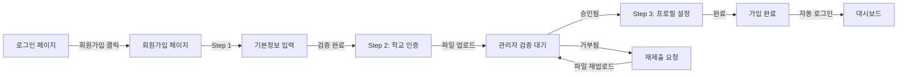
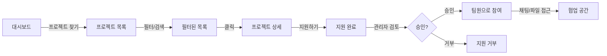
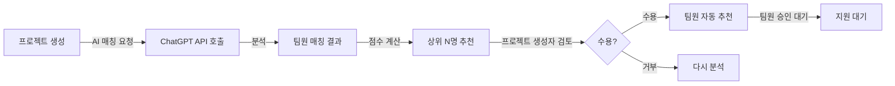

# PeoplPickle - UI 설계서

**작성일**: 2026년 10월 1일  
**버전**: 2.0 (웹 래퍼런스 기반)  
**상태**: 웹 스타일 적용 완료  
**Figma 링크**: [PeoplPickle - Web Design](https://www.figma.com/design/WXoDDr6PLLVWJMXcDLMXwU)  
**설계 참고**: 지학사(교육), 대한항공(프리미엄), 애드웰(복지)

---

## 1. 디자인 시스템 (프로페셔널 웹 스타일)

### 1.1 색상 팔레트

| 이름 | 색상 | 용도 |
|------|------|------|
| Primary | `#1E40AF` | 주요 버튼, 헤더, 강조 요소 (프리미엄 파란색) |
| Secondary | `#0F766E` | 보조 버튼, 링크 (심플 청록) |
| Accent | `#2563EB` | 하이라이트, CTA (밝은 파란색) |
| Success | `#16A34A` | 완료, 승인 (초록) |
| Warning | `#DC2626` | 경고, 에러 (빨간색) |
| Neutral 50 | `#F9FAFB` | 페이지 배경 |
| Neutral 100 | `#F3F4F6` | 섹션 배경 |
| Neutral 900 | `#111827` | 주요 텍스트 |
| Neutral 600 | `#4B5563` | 보조 텍스트 |
| Neutral 300 | `#D1D5DB` | 경계선 |

### 1.2 타이포그래피 (프로페셔널 계층)

| 용도 | 폰트 | 크기 | 굵기 | 라인높이 |
|------|------|------|------|----------|
| XL 제목 (히어로) | Pretendard | 32-36px | Bold (700) | 1.2 |
| L 제목 (페이지) | Pretendard | 24-28px | Bold (700) | 1.3 |
| M 제목 (섹션) | Pretendard | 18-20px | Semi Bold (600) | 1.4 |
| 본문 | Pretendard | 14-16px | Regular (400) | 1.6 |
| 라벨/버튼 | Pretendard | 13-14px | Semi Bold (600) | 1.5 |
| 보조 텍스트 | Pretendard | 12px | Regular (400) | 1.5 |
| 캡션 | Pretendard | 11px | Regular (400) | 1.4 |

### 1.3 스페이싱 (8px 베이스 시스템)

- **XS**: 4px (텍스트 간 간격)
- **S**: 8px (요소 간 간격)
- **M**: 16px (카드 패딩, 섹션 간 간격)
- **L**: 24px (섹션 마진)
- **XL**: 32px (페이지 섹션 간 간격)
- **2XL**: 48px (주요 섹션 구분)

### 1.4 컴포넌트 스타일 (웹 스탠더드)

#### 버튼
- **Primary**: 배경 #1E40AF, 텍스트 흰색, 높이 44px
- **Secondary**: 배경 #F3F4F6, 텍스트 #111827, 높이 44px
- **모서리**: 6px border-radius (모던)
- **상태**:
  - 기본: 정상
  - Hover: 명도 -10% + 그림자 1px
  - Active: 명도 -15%
  - Disabled: 명도 +20%, 커서 not-allowed
- **패딩**: 좌우 16px, 상하 11px (내용 기준)

#### 입력 필드
- **크기**: 높이 40px, 전체 너비
- **테두리**: 1px solid #D1D5DB
- **포커스**: 2px 아웃라인 #2563EB, 배경 #F9FAFB
- **모서리**: 6px border-radius
- **패딩**: 좌우 12px, 상하 8px
- **폰트**: 14px Regular

#### 카드 (프로젝트/사용자)
- **배경**: #FFFFFF
- **테두리**: 1px solid #E5E7EB
- **모서리**: 8px border-radius
- **패딩**: 16px (M 스페이싱)
- **섀도우**: 0 1px 3px rgba(0,0,0,0.1) (미묘한 깊이)
- **호버**: 그림자 강화 0 4px 6px rgba(0,0,0,0.1)

---

## 2. 주요 화면 상세 설계 (웹 표준 레이아웃)

### 2.1 글로벌 네비게이션 (모든 페이지)

```
┌─────────────────────────────────────────────────────────────┐
│  📋 PeoplPickle    [찾기] [내 프로젝트] [메시지]    🔔 👤 ☰  │  ← Header (높이 56px)
└─────────────────────────────────────────────────────────────┘
```

**구성 요소**:
- **로고**: PeoplPickle (좌측, 20px Bold, Primary 색상)
- **메인 네비게이션**: 찾기, 내 프로젝트, 메시지 (중앙, 14px Regular)
- **우측 메뉴**: 알림 아이콘, 프로필 아이콘, 햄버거 메뉴

---

### 2.2 로그인 화면

**경로**: `/login`  
**목적**: 기존 사용자 인증  
**레이아웃**: 센터 정렬 폼 (최대 380px)

```
┌──────────────────────────────────────────────────────────────┐
│                                                              │
│              PeoplPickle                                     │
│              팀 프로젝트 팀원 찾기 플랫폼                      │
│                                                              │
│                                                              │
│              ┌───────────────────────┐                      │
│              │ 로그인                 │                      │
│              ├───────────────────────┤                      │
│              │                       │                      │
│              │ 이메일 또는 아이디     │                      │
│              │ [                   ] │                      │
│              │                       │                      │
│              │ 비밀번호              │                      │
│              │ [                   ] │                      │
│              │                       │                      │
│              │ [ 로그인하기 ]         │ ← 44px, 전체 너비  │
│              │                       │                      │
│              │ ← 비밀번호 잊음         │                      │
│              │ 계정이 없으신가요?     │                      │
│              │ 회원가입 →            │                      │
│              └───────────────────────┘                      │
│                                                              │
│                                                              │
└──────────────────────────────────────────────────────────────┘
```

**카드 스타일**:
- 배경: #FFFFFF
- 테두리: 1px solid #E5E7EB
- 모서리: 8px
- 패딩: 32px (M 스페이싱)
- 최대 너비: 380px
- 중앙 정렬 (페이지)

#### 요소 상세
| 요소 | 타입 | 입력 검증 | 비고 |
|------|------|---------|------|
| 이메일/아이디 | TextField | 이메일 또는 4-20자 영숫자 | Placeholder: "이메일 또는 아이디" |
| 비밀번호 | PasswordField | 필수 입력 | Placeholder: "비밀번호" |
| 로그인 버튼 | Button | - | Primary 색상, 비활성화 상태 지원 |
| 비밀번호 찾기 | Link | - | `/forgot-password` 경로 |
| 회원가입 링크 | Link | - | `/signup` 경로, Secondary 색상 |

#### 사용자 흐름
- **성공**: JWT 토큰 발급 → `/dashboard`로 리다이렉트
- **실패**: 에러 토스트 메시지 "이메일/비밀번호가 일치하지 않습니다" (3초)
- **3회 실패**: 계정 30분 잠금 안내

---

### 2.3 회원가입 화면 (3단계)

**경로**: `/signup`  
**목적**: 새 사용자 계정 생성  
**레이아웃**: 진행률 표시 + 센터 폼

```
┌──────────────────────────────────────────────────────────────┐
│  ← 뒤로    회원가입 (1/3) ████░░░░░░ 33%                      │
├──────────────────────────────────────────────────────────────┤
│                                                              │
│  기본 정보                                                    │
│                                                              │
│  아이디 *                                                    │
│  [                                                        ]  │
│  ✓ 사용 가능한 아이디입니다 (또는 ✗ 이미 사용 중인 아이디)  │
│                                                              │
│  이메일 *                                                    │
│  [                                                        ]  │
│                                                              │
│  비밀번호 * (8자 이상, 특수문자 포함)                        │
│  [                                                        ]  │
│  비밀번호 강도: ▓▓▓░░ (강함)                                │
│                                                              │
│  비밀번호 확인 *                                            │
│  [                                                        ]  │
│                                                              │
│  이름 * (한글 또는 영문)                                     │
│  [                                                        ]  │
│                                                              │
│  휴대폰 번호 * (010-XXXX-XXXX)                              │
│  [                                                        ]  │
│                                                              │
│  ┌────────────────────────────────────────────────────────┐ │
│  │ [ 이전 ]                            [ 다음 ] (Disabled)   │ │
│  └────────────────────────────────────────────────────────┘ │
│                                                              │
└──────────────────────────────────────────────────────────────┘
```

**Step 1 검증 규칙**:
| 필드 | 규칙 | 실시간 검증 |
|------|------|-----------|
| 아이디 | 영숫자, 4-20자 | O (중복 확인) |
| 이메일 | 유효한 형식 | O (중복 확인) |
| 비밀번호 | 8자+, 특수문자 | O (강도 표시) |
| 이름 | 한글/영문, 2-30자 | O |
| 휴대폰 | 하이픈 자동 추가 | O |

---

**Step 2: 학교 인증**

```
┌──────────────────────────────────────────────────────────────┐
│  ← 뒤로    학교 인증 (2/3) ████████░░ 67%                    │
├──────────────────────────────────────────────────────────────┤
│                                                              │
│  대학교 인증                                                  │
│                                                              │
│  대학 검색 *                                                 │
│  [서울대학교 ▼]                                             │
│                                                              │
│  인증 방법                                                    │
│                                                              │
│  ○ 학생증 업로드                                            │
│    [파일 선택] (JPG/PNG, 최대 5MB)                           │
│    파일을 여기에 드래그하거나 클릭하세요                    │
│                                                              │
│  ○ 대학 이메일 인증                                         │
│    [ @korea.ac.kr ]                                        │
│    [인증 메일 전송]                                        │
│    ※ 메일에서 확인 링크를 클릭하여 인증 완료              │
│                                                              │
│  ┌────────────────────────────────────────────────────────┐ │
│  │ [ 이전 ]                            [ 다음 ]            │ │
│  └────────────────────────────────────────────────────────┘ │
│                                                              │
│  ※ 관리자 검증 대기: 24시간 이내에 처리됩니다              │
│                                                              │
└──────────────────────────────────────────────────────────────┘
```

---

**Step 3: 프로필 설정**

```
┌──────────────────────────────────────────────────────────────┐
│  ← 뒤로    프로필 설정 (3/3) ██████████ 100%                 │
├──────────────────────────────────────────────────────────────┤
│                                                              │
│  프로필 정보                                                  │
│                                                              │
│  프로필 사진 (선택)                                         │
│  [📷 사진 선택]                                            │
│                                                              │
│  학과 *                                                      │
│  [컴퓨터공학과              ]                              │
│                                                              │
│  기술스택 * (다중선택)                                      │
│  ☐ Java ☐ Python ☐ JavaScript ☐ React                    │
│  ☐ Vue ☐ Spring Boot ☐ Node.js ☐ Go                      │
│                                                              │
│  관심분야 (다중선택)                                        │
│  ☐ AI ☐ 웹개발 ☐ 모바일 ☐ 게임                           │
│  ☐ 데이터 ☐ 클라우드 ☐ DevOps                            │
│                                                              │
│  희망역할 (다중선택)                                        │
│  ☐ 백엔드 ☐ 프론트엔드 ☐ 풀스택 ☐ PM ☐ 디자인            │
│                                                              │
│  활동 가능 시간                                              │
│  월□ 수□ 금□ 토□ 일□ - 14:00~22:00                        │
│                                                              │
│  ┌────────────────────────────────────────────────────────┐ │
│  │ [ 이전 ]                        [ 회원가입 완료 ]      │ │
│  └────────────────────────────────────────────────────────┘ │
│                                                              │
└──────────────────────────────────────────────────────────────┘
```

---

### 2.4 대시보드 (홈)

**경로**: `/dashboard` (로그인 후 기본 페이지)  
**목적**: 사용자 활동 요약 및 빠른 접근  
**레이아웃**: 풀너비 + 카드 그리드 (최대 1200px)

```
┌──────────────────────────────────────────────────────────────┐
│ 📋 PeoplPickle     [찾기] [내 프로젝트]        🔔 👤 ☰      │  Header
├──────────────────────────────────────────────────────────────┤
│                                                              │
│  안녕하세요, 철수님 👋                                        │
│  오늘은 어떤 팀원을 만나볼까요?                            │
│                                                              │
│  ┌──────────────────────┐  ┌──────────────────────┐          │
│  │ 📊 모집중 프로젝트   │  │ 💼 내가 참여 중     │          │ 
│  │ 12개                 │  │ 3개                  │          │
│  │ 새로운 팀원 찾기 →   │  │ 진행 상황 확인 →    │          │
│  └──────────────────────┘  └──────────────────────┘          │
│                                                              │
│  ┌──────────────────────┐  ┌──────────────────────┐          │
│  │ ⏳ 지원 대기 중      │  │ ✓ 완료된 프로젝트   │          │
│  │ 2개                  │  │ 5개                  │          │
│  │ 결과 확인하기 →      │  │ 실적 보기 →         │          │
│  └──────────────────────┘  └──────────────────────┘          │
│                                                              │
│  최근 활동                                                    │
│  ──────────────────────────────────────────────────────────  │
│  • 2시간 전: AI 스터디 프로젝트에 지원했습니다              │
│  • 1일 전: 프로필 정보를 업데이트했습니다                  │
│  • 3일 전: 웹 커머스 개발 프로젝트에 합류했습니다          │
│                                                              │
│  추천 프로젝트                                                │
│  ───────────────────────────────────────────────────────────  │
│  ┌─────────────────────┐  ┌─────────────────────┐            │
│  │ React 웹 개발       │  │ Python AI 프로젝트  │            │
│  │ 모집중 2/4          │  │ 모집중 1/5          │            │
│  │ React, Node.js      │  │ Python, TensorFlow  │            │
│  │ [자세히 보기]      │  │ [자세히 보기]      │            │
│  └─────────────────────┘  └─────────────────────┘            │
│                                                              │
└──────────────────────────────────────────────────────────────┘
```

**섹션 설명**:
1. **환영 메시지**: 사용자명 동적 출력, 오늘의 격언 또는 추천 문구
2. **빠른 액세스 카드** (4개): 각 카드는 클릭 가능, 호버 시 섀도우 강화
3. **최근 활동**: 타임라인 형식, 스크롤 가능
4. **추천 프로젝트**: 2컬럼 그리드, 프로젝트명/상태/기술스택 표시

---

### 2.5 프로젝트 목록 화면

**경로**: `/projects`  
**목적**: 모든 프로젝트 검색 및 조회  
**레이아웃**: 검색/필터 바 + 카드 그리드

```
┌──────────────────────────────────────────────────────────────┐
│ 📋 PeoplPickle     [찾기] [내 프로젝트]        🔔 👤 ☰      │
├──────────────────────────────────────────────────────────────┤
│                                                              │
│  프로젝트 찾기                                                │
│                                                              │
│  [🔍 프로젝트 검색...                         ] 🔍         │
│                                                              │
│  필터: [기술스택 ▼] [역할 ▼] [상태 ▼] [초기화]              │
│                                                              │
│  결과: 24개                           [신규순 ▼]            │
│  ──────────────────────────────────────────────────────────  │
│                                                              │
│  ┌──────────────────────┐  ┌──────────────────────┐          │
│  │ AI 기반 스터디       │  │ 웹 커머스 개발      │          │
│  │ 플랫폼              │  │                      │          │
│  │                      │  │ Java, Spring Boot   │          │
│  │ Java, Python        │  │ 모집중 2/5명        │          │
│  │ 모집중 3/5명        │  │                      │          │
│  │ 📍 서울대학교       │  │ 📍 연세대학교       │          │
│  │ [지원하기]         │  │ [지원하기]         │          │
│  └──────────────────────┘  └──────────────────────┘          │
│                                                              │
│  ┌──────────────────────┐  ┌──────────────────────┐          │
│  │ 모바일 게임 개발     │  │ iOS 앱 개발         │          │
│  │                      │  │                      │          │
│  │ C++, Unity          │  │ Swift, Xcode        │          │
│  │ 모집중 1/4명        │  │ 모집중 2/3명        │          │
│  │ 📍 고려대학교       │  │ 📍 카이스트         │          │
│  │ [지원하기]         │  │ [지원하기]         │          │
│  └──────────────────────┘  └──────────────────────┘          │
│                                                              │
│  페이지: [◀ 1 2 3 4 5 ... ▶]                                │
│                                                              │
└──────────────────────────────────────────────────────────────┘
```

**카드 요소**:
- 프로젝트명 (14px Bold)
- 기술스택 (태그 형식, 12px)
- 모집 현황 (11px, Secondary 색상)
- 대학교 정보 (11px, 회색)
- CTA 버튼 (44px)

**필터 옵션**:
- 기술스택: 드롭다운 (다중선택)
- 역할: 드롭다운 (백엔드, 프론트엔드, 디자인, PM, DevOps)
- 상태: 드롭다운 (모집중, 진행중, 완료)

---

### 2.6 프로젝트 상세 화면

**경로**: `/projects/:projectId`  
**목적**: 프로젝트 정보 조회 및 지원  
**레이아웃**: 1컬럼 + 오른쪽 사이드바 (1200px)

```
┌──────────────────────────────────────────────────────────────┐
│ 📋 PeoplPickle     [찾기] [내 프로젝트]        🔔 👤 ☰      │
├──────────────────────────────────────────────────────────────┤
│  ◀ 뒤로                                                      │
│                                                              │
│  ┌──────────────────────────────┐  ┌──────────────────────┐ │
│  │ AI 기반 스터디 플랫폼         │  │ 📋 프로젝트 정보    │ │
│  │ (프로젝트명)                  │  │ ──────────────────  │ │
│  │                              │  │ 상태: 모집 진행중   │ │
│  │ Java, Spring Boot            │  │ 팀원: 3/5명         │ │
│  │ React, JavaScript            │  │ 기간: 8주           │ │
│  │ Python, TensorFlow           │  │ 방식: 온라인        │ │
│  │                              │  │                      │ │
│  │ ─────────────────────────────  │ │ [프로젝트에 지원]  │ │
│  │ 프로젝트 소개                  │  │ [공유하기]         │ │
│  │                              │  │ [더보기]           │ │
│  │ 이 프로젝트는 대학생들이 팀   │  │                      │ │
│  │ 프로젝트를 효율적으로 진행할  │  │ ──────────────────  │ │
│  │ 수 있도록 돕는 AI 매칭 플랫폼  │  │ 팀원 (3명)         │ │
│  │ 입니다. 효율적인 팀 구성을    │  │ ──────────────────  │ │
│  │ 위해 AI 기반 추천 시스템을    │  │ 김철수              │ │
│  │ 활용합니다.                   │  │ PM                  │ │
│  │                              │  │                      │ │
│  │ 진행 기간: 2024.10~12 (8주)  │  │ 이영희              │ │
│  │ 모집 종료: 2024.10.15        │  │ 백엔드 리드         │ │
│  │ 진행 방식: 온라인             │  │                      │ │
│  │ 생성자: 김철수                │  │ 박민수              │ │
│  │        (프로필 링크)          │  │ 프론트엔드          │ │
│  │                              │  │                      │ │
│  │ ─────────────────────────────  │ │ ──────────────────  │ │
│  │ 필요 역할 (2자리 남음)         │  │ AI 매칭 추천       │ │
│  │ ──────────────────────────────  │ │ ──────────────────  │ │
│  │ • 백엔드 2명 (현재: 1명)      │  │ 추천 점수: 89%     │ │
│  │ • 프론트엔드 2명 (현재: 1명)  │  │ • 기술: 85%        │ │
│  │ • 디자인 1명 (현재: 1명)      │  │ • 역할: 92%        │ │
│  │                              │  │ • 시간: 88%        │ │
│  │                              │  │                      │ │
│  │ [프로필 보기]  [프로필 보기]   │  │ [지원하기]         │ │
│  │                              │  │                      │ │
│  └──────────────────────────────┘  └──────────────────────┘ │
│                                                              │
│  댓글 (2개)                                                  │
│  ──────────────────────────────────────────────────────────  │
│  김철수: 적극적으로 참여할 수 있는 분들을 찾습니다!       │
│  2024.10.01 14:30                                          │
│                                                              │
│  이영희: 진행 일정이 유연한 편입니다. 편한 시간에 참여하세요│
│  2024.10.01 15:20                                          │
│                                                              │
│  [댓글 작성...]                                            │
│                                                              │
└──────────────────────────────────────────────────────────────┘
```

**메인 콘텐츠 섹션**:
1. **프로젝트 헤더**: 프로젝트명, 기술스택 태그, 기본 정보
2. **프로젝트 소개**: 텍스트, 기간, 모집 종료일, 진행 방식, 생성자
3. **필요 역할**: 역할별 필요 인원/현재 승인 인원 (진행바 표시)
4. **팀원 카드**: 프로필 사진, 이름, 역할 (클릭 시 `/profile/:userId`로 이동)
5. **댓글**: 프로젝트 관련 질문 또는 공지사항

**사이드바 요소**:
- **프로젝트 정보 카드**: 상태, 팀원, 기간, 방식 (배경 #F9FAFB)
- **CTA 버튼**: 지원, 공유, 더보기
- **팀원 미니 카드**: 3명까지만 표시, "모두 보기" 링크
- **AI 매칭 추천**: 적합도 점수 + 세부 점수

---

### 2.7 사용자 프로필 페이지

**경로**: `/profile` (본인), `/profile/:userId` (타인)  
**목적**: 사용자 정보 조회 및 수정  
**레이아웃**: 프로필 헤더 + 탭 네비게이션 + 콘텐츠

```
┌──────────────────────────────────────────────────────────────┐
│ 📋 PeoplPickle     [찾기] [내 프로젝트]        🔔 👤 ☰      │
├──────────────────────────────────────────────────────────────┤
│                                                              │
│  ┌─────────────────────────────────────────────────────┐   │
│  │  [👤]   김철수  |  컴퓨터공학과                       │   │
│  │  (사진)  kim@snu.ac.kr  |  서울대학교                │   │
│  │          [프로필 수정] [팔로우]  [공유]              │   │
│  └─────────────────────────────────────────────────────┘   │
│                                                              │
│  기본정보 | 기술스택 | 참여 프로젝트 | 활동                 │
│  ──────────────────────────────────────────────────────────  │
│                                                              │
│  기본정보 섹션                                                │
│  ──────────────────────────────────────────────────────────  │
│                                                              │
│  이메일: kim@snu.ac.kr  |  대학: 서울대학교 (인증완료 ✓)   │
│  학과: 컴퓨터공학과      |  입학: 2021년                    │
│  휴대폰: 010-XXXX-XXXX  |  가입일: 2024.09.15             │
│                                                              │
│  관심분야                                                    │
│  AI, 웹개발, 모바일 앱                                     │
│                                                              │
│  희망역할                                                    │
│  백엔드, 풀스택 개발                                        │
│                                                              │
│  활동 가능 시간                                              │
│  월-금: 14:00~22:00 | 토-일: 13:00~22:00                 │
│                                                              │
│  포트폴리오                                                  │
│  🔗 GitHub: github.com/kim                                  │
│  🔗 Blog: kim.dev                                           │
│  🔗 드라이브: bit.ly/kim-portfolio                          │
│                                                              │
│  [이전] [프로필 수정] [비밀번호 변경] [계정 탈퇴]         │
│                                                              │
│  참여 프로젝트 섹션                                          │
│  ──────────────────────────────────────────────────────────  │
│  생성한 프로젝트 (1개)                                       │
│                                                              │
│  ┌────────────────────────────────┐                        │
│  │ AI 기반 스터디 플랫폼          │                        │
│  │ PM                             │                        │
│  │ 2024.10~12 (진행중)            │                        │
│  │ [바로가기]                     │                        │
│  └────────────────────────────────┘                        │
│                                                              │
│  참여 프로젝트 (2개)                                        │
│                                                              │
│  ┌────────────────────────────────┐                        │
│  │ 웹 커머스 개발                  │                        │
│  │ 프론트엔드                      │                        │
│  │ 2024.08~09 (완료)              │                        │
│  │ [바로가기]                     │                        │
│  └────────────────────────────────┘                        │
│                                                              │
└──────────────────────────────────────────────────────────────┘
```

**본인 프로필 추가 요소**:
- [프로필 수정] 버튼 (편집 모드로 진입)
- [비밀번호 변경] 버튼 (모달)
- [계정 탈퇴] 버튼 (경고 모달)

**타인 프로필 추가 요소**:
- [팔로우] 버튼 (팀원 모니터링)
- [공유] 버튼 (SNS 공유)
- [프로젝트에 직접 초대] 버튼 (프로젝트 생성자 전용)

---

### 2.8 프로젝트 생성 화면

**경로**: `/projects/create`  
**목적**: 새로운 프로젝트 생성  
**레이아웃**: 싱글 페이지 긴 폼 또는 탭 형식

```
┌──────────────────────────────────────────────────────────────┐
│ 📋 PeoplPickle     [찾기] [내 프로젝트]        🔔 👤 ☰      │
├──────────────────────────────────────────────────────────────┤
│  ◀ 뒤로                                                      │
│                                                              │
│  새 프로젝트 생성                                              │
│  ─────────────────────────────────────────────────────────── │
│                                                              │
│  기본 정보                                                    │
│  ──────────────────────────────────────────────────────────  │
│                                                              │
│  프로젝트명 *                                                │
│  [                                                        ]  │
│                                                              │
│  프로젝트 설명 * (최대 500자)                                │
│  ┌──────────────────────────────────────────────────────┐  │
│  │                                                      │  │
│  │                                                      │  │
│  │                                                      │  │
│  └──────────────────────────────────────────────────────┘  │
│                                                              │
│  기술 스택 * (다중선택)                                     │
│  ☐ Java ☐ Python ☐ JavaScript ☐ React                    │
│  ☐ Vue ☐ Spring Boot ☐ Node.js ☐ Go                      │
│  [더 보기 ▼]                                              │
│                                                              │
│  필요 역할 및 인원 수                                        │
│  ─────────────────────────────────────────────────────────── │
│                                                              │
│  역할 * | 필요 인원                                          │
│  ──────────────────────────────────────────────────────────  │
│  ☐ 백엔드     | [2     ] 명                                  │
│  ☐ 프론트엔드 | [2     ] 명                                  │
│  ☐ 디자인     | [1     ] 명                                  │
│  ☐ PM        | [1     ] 명                                  │
│  ☐ DevOps    | [       ] 명 (선택)                          │
│                                                              │
│  프로젝트 기간                                                │
│  ──────────────────────────────────────────────────────────  │
│                                                              │
│  시작일 * | [2024-10-01 ▼]   종료일 * | [2024-12-31 ▼]    │
│  예상 기간: 12주                                            │
│                                                              │
│  진행 방식 *                                                 │
│  ○ 온라인  ○ 오프라인  ○ 혼합 (온라인 + 오프라인)          │
│                                                              │
│  모집 설정                                                    │
│  ──────────────────────────────────────────────────────────  │
│                                                              │
│  모집 마감일 * | [2024-10-15 ▼]  (프로젝트 시작 전)        │
│                                                              │
│  팀원 자동 승인                                              │
│  ○ 활성화 (즉시 승인)  ○ 비활성화 (관리자 검토)            │
│                                                              │
│  추가 정보                                                    │
│  ──────────────────────────────────────────────────────────  │
│                                                              │
│  기대하는 팀원 특성 (선택)                                  │
│  ┌──────────────────────────────────────────────────────┐  │
│  │                                                      │  │
│  │                                                      │  │
│  └──────────────────────────────────────────────────────┘  │
│                                                              │
│  ┌────────────────────────────────────────────────────────┐ │
│  │ [취소]                             [프로젝트 생성]     │ │
│  └────────────────────────────────────────────────────────┘ │
│                                                              │
│  ※ 모든 필수 항목 (*)을(를) 입력해야 진행할 수 있습니다   │
│                                                              │
└──────────────────────────────────────────────────────────────┘
```

**검증 규칙**:
| 필드 | 규칙 |
|------|------|
| 프로젝트명 | 필수, 5-100자 |
| 설명 | 필수, 20-500자 |
| 기술스택 | 최소 1개 선택 |
| 역할/인원 | 최소 1개 역할 선택, 1명 이상 |
| 기간 | 시작일 ≤ 종료일, 최소 1주 |
| 모집 마감 | 모집 마감 < 프로젝트 시작 |

---

### 2.9 협업 공간 (채팅)

**경로**: `/projects/:projectId/chat`  
**접근 권한**: 승인된 팀원만  
**목적**: 팀 내 실시간 커뮤니케이션  
**레이아웃**: 메시지 리스트 + 입력 바

```
┌──────────────────────────────────────────────────────────────┐
│ AI 프로젝트                      [파일] [팀원: 5명] [✕]     │  Header
├──────────────────────────────────────────────────────────────┤
│                                                              │
│                                                              │
│                                  ┌──────────────┐            │
│                                  │  안녕하세요! │ 철수      │  
│                                  │              │ 14:30    │
│                                  └──────────────┘            │
│                                                              │
│  ┌──────────────┐                                          │
│  │ 네 시작하    │ 영희                                        │
│  │ 겠습니다     │ 14:32                                      │
│  └──────────────┘                                          │
│                                                              │
│  [📎 design_v1.zip]                                        │
│  2.5 MB  | 다운로드 ↓  | 2시간 전                           │
│                                                              │
│                                  ┌──────────────────┐       │
│                                  │ 좋습니다! 진행  │ 민수   │
│                                  │ 하겠습니다!      │ 14:35 │
│                                  └──────────────────┘       │
│                                                              │
│                                                              │
├──────────────────────────────────────────────────────────────┤
│  [📎] [😊]  [메시지 입력...]                  [▶ 전송]    │
│                                                              │
└──────────────────────────────────────────────────────────────┘
```

**메시지 구조**:
- **텍스트 메시지**: 발신자명(좌측), 타임스탬프, 메시지 내용 (말풍선)
- **파일 메시지**: 파일 아이콘 + 파일명 + 크기 + 다운로드 버튼
- **시스템 메시지**: 회색 배경, 중앙 정렬 (예: "김철수님이 팀원으로 추가되었습니다")

**입력 영역 기능**:
- 📎: 파일 첨부 (최대 10MB)
- 😊: 이모지 피커
- 메시지 입력 필드: Placeholder "메시지 입력..."
- ▶ 전송: 클릭 또는 Enter 키

**@멘션 지원**: "안녕 @철수!" → 철수에게 알림

---

### 2.10 파일 공유 탭

**경로**: `/projects/:projectId/files`  
**접근 권한**: 승인된 팀원만  
**목적**: 프로젝트 관련 파일 저장소  
**레이아웃**: 폴더 구조 + 파일 리스트

```
┌──────────────────────────────────────────────────────────────┐
│ AI 프로젝트                      [채팅] [팀원: 5명] [✕]     │  Header
├──────────────────────────────────────────────────────────────┤
│                                                              │
│  [📤 파일 업로드]  [+ 새 폴더]                             │
│                                                              │
│  ──────────────────────────────────────────────────────────  │
│  📁 설계                                                     │
│  │                                                          │
│  ├─ design_v1.zip     │ 2.5MB | 철수 업로드 | 2일 전 | ↓  │
│  ├─ mockup.fig        │ 5.8MB | 영희 업로드 | 1일 전 | ↓  │
│  └─ wireframe.pdf     │ 3.2MB | 민수 업로드 | 3일 전 | ↓  │
│                                                              │
│  📁 문서                                                     │
│  │                                                          │
│  ├─ 요구사항.docx     │ 1.2MB | 철수 업로드 | 5일 전 | ↓  │
│  ├─ 일정.xlsx         │ 0.5MB | 영희 업로드 | 3일 전 | ↓  │
│  └─ 회의록.txt        │ 0.2MB | 민수 업로드 | 1일 전 | ↓  │
│                                                              │
│  📁 코드                                                     │
│  │                                                          │
│  ├─ main.java         │ 45KB  | 철수 업로드 | 2시간 전| ↓  │
│  └─ utils.java        │ 23KB  | 영희 업로드 | 1시간 전| ↓  │
│                                                              │
│  [📄 기타 파일]                                            │
│  ├─ 프로젝트_개요.pptx  │ 8.5MB | 철수 업로드 | 1주 전 | ↓  │
│  └─ 예산안.pdf        │ 2.1MB | 경영팀 업로드| 5일 전 | ↓  │
│                                                              │
└──────────────────────────────────────────────────────────────┘
```

**파일 리스트 요소**:
| 요소 | 내용 | 크기 |
|------|------|------|
| 파일 아이콘 | 파일 타입별 아이콘 (📎, 📄, etc.) | 16x16px |
| 파일명 | 전체 이름 | 14px Regular |
| 파일 크기 | "2.5MB" 또는 "45KB" | 12px Gray |
| 업로더 | "철수 업로드" | 12px Gray |
| 업로드 시간 | "2일 전" 또는 타임스탬프 | 12px Gray |
| 다운로드 | ↓ 버튼 (호버 시 표시) | 아이콘 |
| 삭제 | 🗑️ (업로더만) | 아이콘 |

**폴더 기능**:
- **자동 분류**: 업로드 시 파일 타입에 따라 자동 분류
  - 디자인 파일 → "설계" 폴더 (Figma, PNG, JPG, etc.)
  - 문서 → "문서" 폴더 (DOCX, PDF, XLSX, etc.)
  - 코드 → "코드" 폴더 (Java, JS, Python, etc.)
- **수동 생성**: [+ 새 폴더] 버튼으로 커스텀 폴더 생성 가능
- **Drag & Drop**: 파일을 폴더에 드래그하여 이동

**파일 업로드**:
- 클릭 또는 Drag & Drop
- 최대 파일 크기: 10MB
- 지원 형식: 모든 일반 파일 (특정 제한 없음)
- 진행 표시: 업로드 중 프로그레스 바

**다운로드**:
- ↓ 버튼 클릭 시 브라우저 기본 다운로드
- 여러 파일 선택 후 일괄 다운로드 가능 (ZIP 압축)

---

## 3. 사용자 플로우

### 3.1 회원가입 플로우



### 3.2 프로젝트 찾기 및 지원 플로우



### 3.3 AI 매칭 플로우



---

## 4. 반응형 디자인 (데스크톱 우선)

### 4.1 화면 크기별 레이아웃

**PeoplPickle은 데스크톱 우선 설계입니다.** 모든 화면은 최소 1200px 너비를 기준으로 설계되며, 더 작은 화면에 맞추어 조정됩니다.

| 기기 | 너비 | 레이아웃 | 특징 |
|------|------|---------|------|
| **데스크톱** | **1200px+** | **3컬럼 레이아웃** | **기본 설계 타겟, 풀 기능 제공** |
| | | 사이드바 + 메인 콘텐츠 + 우측 패널 | 프로젝트 목록, 필터, 세부 정보 동시 표시 |
| | | 최대 콘텐츠 너비 1400px | 대형 카드 그리드 가능 (3-4 컬럼) |
| **태블릿** | 768-1199px | 2컬럼 또는 축소 3컬럼 | 네비게이션 축소, 사이드바 숨김 가능 |
| | | 프로젝트 카드: 2컬럼 | 터치 친화적 버튼 크기 유지 (44px) |
| **모바일** | <768px | 단일 컬럼 | 하단 탭 네비게이션 |
| | | 풀너비 요소 | 모든 버튼 44px 이상 |

### 4.2 데스크톱 우선 설계 원칙

1. **기본 해상도**: 1200x800px 이상 모니터 기준
   - 노트북, 데스크톱 환경에 최적화
   - 업무용 대학 컴퓨터실 환경 지원

2. **콘텐츠 우선순위**:
   - 데스크톱: 정보 밀도 높음 (한 화면에 최대 정보 제공)
   - 태블릿: 정보 선택적 표시
   - 모바일: 순차적 네비게이션

3. **네비게이션**:
   - 데스크톱: 상단 수평 네비게이션 + 좌측 메뉴 (선택)
   - 태블릿: 해밍버거 메뉴 + 상단 바
   - 모바일: 하단 탭 네비게이션 (고정)

4. **버튼 및 입력 필드**:
   - 최소 크기: 44px (터치 타겟)
   - 데스크톱에서 44-50px
   - 모바일에서 48-56px (터치 안전 구간)

---

## 5. 접근성 및 사용성

### 5.1 색상 대비
- 텍스트 대 배경: WCAG AA 표준 (4.5:1 이상)
- Primary 색상의 흰색 텍스트: ✅ 준수
- Secondary 색상의 어두운 텍스트: ✅ 준수

### 5.2 포커스 상태
- 모든 인터랙티브 요소: 포커스 시 시각적 표시
- 탭 키 네비게이션: 우측에서 좌측, 상향식

### 5.3 스크린 리더 지원
- 모든 버튼 및 아이콘: ARIA 라벨 추가
- 폼 필드: Label 태그 연결
- 이미지: 대체 텍스트 (Alt text) 작성

---

## 6. 마이크로 인터랙션

### 6.1 로딩 상태
- 버튼 클릭 후: 로딩 스피너 표시
- API 응답 대기 중: Disabled 상태 유지

### 6.2 에러 처리
- 입력 오류: 빨간색 테두리 + 에러 메시지
- 서버 오류: 토스트 메시지 (우측 상단, 3초 표시)
- 네트워크 오류: 재시도 버튼 포함

### 6.3 성공 피드백
- 작업 완료: 녹색 체크마크 + 토스트 메시지
- 자동 사라짐: 2-3초 후

### 6.4 애니메이션
- 페이지 전환: 부드러운 페이드인 (200ms)
- 드롭다운 열림: 슬라이드다운 (150ms)
- 토스트 메시지: 슬라이드인 (250ms)

---

## 7. 상태 표시

### 7.1 프로젝트 상태
| 상태 | 색상 | 의미 |
|------|------|------|
| 모집중 | Accent #2563EB (밝은 파란색) | 팀원 모집 진행 중 |
| 모집완료 | Warning #DC2626 (빨간색) | 모집 마감 |
| 진행중 | Primary #1E40AF (짙은 파란색) | 프로젝트 진행 중 |
| 완료 | Neutral #6B7280 (회색) | 프로젝트 완료 |

### 7.2 지원 상태
| 상태 | 표시 | 색상 | 의미 |
|------|------|------|------|
| 대기중 | ⏳ | Warning #DC2626 | 프로젝트 생성자 검토 중 |
| 승인됨 | ✅ | Success #16A34A | 팀원으로 승인됨 |
| 거부됨 | ❌ | Danger #DC2626 | 지원 거부됨 |

---

## 8. 보안 고려사항

### 8.1 입력 검증
- 모든 폼: 클라이언트 사이드 검증 + 서버 사이드 검증
- 파일 업로드: 파일 타입 및 크기 제한
- XSS 방지: HTML 이스케이프 처리

### 8.2 인증 상태
- JWT 토큰 만료: 401 에러 → 로그인 페이지로 리다이렉트
- CSRF 토큰: 모든 POST 요청에 포함
- HTTPS 필수

---

## 9. 성능 최적화

### 9.1 이미지 최적화
- 프로필 사진: WebP 포맷, 100x100px
- 썸네일: 50x50px
- 배경: SVG 또는 최적화된 PNG

### 9.2 지연 로딩
- 프로젝트 목록: 무한 스크롤 (10개씩)
- 메시지: 최신 20개 먼저 로드, 위로 스크롤 시 이전 메시지 로드

### 9.3 캐싱
- 프로필 정보: 로컬 스토리지 캐시 (1시간)
- 프로젝트 목록: 메모리 캐시 (5분)

---

## 10. 다크 모드 (선택사항)

향후 추가 예정. 현재는 라이트 모드만 지원.

---

## 11. 설계 체크리스트

설계 검증 시 확인 사항:

- [ ] 모든 화면에서 네비게이션 일관성 유지
- [ ] 색상 대비 WCAG AA 표준 준수
- [ ] 모든 버튼 크기 44x44px 이상 (터치)
- [ ] 입력 필드 포커스 표시 명확함
- [ ] 에러 메시지 명확하고 건설적임
- [ ] 로딩 상태 시각적으로 표시됨
- [ ] 모든 폼 필드에 라벨 존재
- [ ] 링크 vs 버튼 구분 명확함
- [ ] 페이지 스크롤 가능성 확인
- [ ] 아이콘 의미 명확함

---

## 12. 개발 주의사항

### 12.1 프론트엔드 (HTML/CSS/JavaScript)
- **반응형 CSS**: Desktop-First 방식 (1200px 기본, 미디어 쿼리로 축소)
- **폰트**: Pretendard (한글), Inter (영문) - Google Fonts + CDN
- **아이콘**: Font Awesome 6+ 또는 Material Icons
- **레이아웃**: CSS Grid / Flexbox (BEM 네이밍 규칙)
- **웹 표준**: HTML5 Semantic, CSS3, ES6+ JavaScript
- **접근성**: ARIA 라벨, Keyboard Navigation, Screen Reader 지원

### 12.2 백엔드 통합
- API 응답 형식: JSON
- 페이지네이션: offset / limit
- 에러 응답: HTTP 상태 코드 + 에러 메시지
- 인증: JWT Bearer 토큰

### 12.3 테스트
- 단위 테스트: 컴포넌트별
- E2E 테스트: 주요 플로우 (회원가입, 프로젝트 생성, 지원)
- 성능 테스트: 페이지 로드 시간 < 3초

---

## 부록: 참고 자료

### A. 디자인 참고 자료
본 UI설계서는 다음 전문적 웹사이트의 디자인 패턴을 참고하여 작성되었습니다:

1. **지학사 교육 플랫폼** (https://textbook.jihak.co.kr/)
   - 카드형 그리드 레이아웃
   - 깔끔하고 구조화된 정보 표시
   - 전문적이고 신뢰감 있는 색상 사용

2. **대한항공 프리미엄 사이트** (https://www.koreanair.com/)
   - 세련된 헤더와 네비게이션
   - 여유 있는 spacing과 typography
   - 프리미엄 사용자 경험

3. **애드웰 복지 플랫폼** (https://www.addwel.co.kr/)
   - 직관적인 메뉴 구조
   - 사용자 중심의 인터페이스
   - 명확한 CTA와 정보 계층

### B. 설계 파일 및 문서

**Figma 디자인 파일:**
- **메인 파일**: [PeoplPickle - Web Design](https://www.figma.com/design/WXoDDr6PLLVWJMXcDLMXwU)
  - 상태: 진행 중 (3개 페이지 완성, 5+ 페이지 계획)
  - 페이지: 홈(데스크톱), 로그인(데스크톱), 대시보드(데스크톱)
  - 색상: 프리미엄 파란색 기반 (#1E40AF, #2563EB)
  - 접근: 팀원 공유 가능

**관련 문서:**
- [요구사항분석서](./요구사항분석서.md) - 18개 REQ, 6개 기능 카테고리
- [DB 설계서](./DB설계서.md) - 예정 (2026-10-15 완료)
- [API 문서](./API문서.md) - 예정 (Swagger 기반)
- [개발 일정](./개발일정.md) - 3단계 추진 계획

### C. 기술 스택 레퍼런스

**프론트엔드:**
- HTML5, CSS3, Vanilla JavaScript
- 폰트: Pretendard (한글), Inter (영문)
- 아이콘: Font Awesome 6+
- 라이브러리: 동적 로드 검토 중 (React/Vue 미사용, 순수 JS)

**백엔드:**
- Spring Boot 3.x
- Java 21+
- MySQL 8.0+
- WebSocket (Socket.IO 또는 Spring WebSocket)

**외부 API:**
- ChatGPT API (AI 팀원 매칭)
- Figma API (디자인 파일 동기화)

### D. 웹 스타일 가이드 (2.0 버전 기준)

**색상 팔레트 변경 히스토리:**
- v1.0 (AI 테마): #5E5CE6 (보라), #00BFA5 (청록)
- v2.0 (프리미엄 웹): #1E40AF (짙은 파란), #0F766E (심플 청록)

**디자인 철학:**
- 전문성: 대학 프로젝트 협업 플랫폼의 공신력
- 단순성: 과하지 않은 색상과 요소 배치
- 접근성: WCAG AA 표준 준수
- 효율성: 한 화면에 필요한 정보만 표시 (정보 밀도)

---

**문서 버전**: 2.0 (웹 래퍼런스 기반 리디자인)  
**최종 수정일**: 2026년 10월 1일  
**설계 패턴**: 프리미엄 한국 웹사이트 기반  
**담당자**: AI 설계 팀  
**상태**: 웹 스타일 적용 완료
